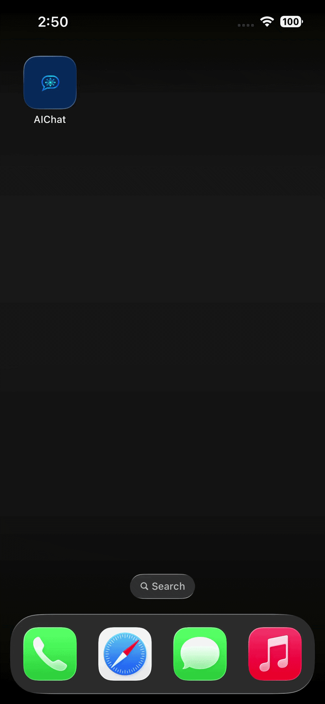

# AI Chat App 🤖

A SwiftUI iOS chat app with real-time AI streaming responses, 
multiple personas, and persistent conversation history.

## 📱 Screenshots
## 📱 Demo



## ✨ Features
- 💬 Real-time streaming AI responses
- 🎭 Multiple AI personas (Assistant, Teacher, Coach, Sarcastic)
- 💾 Persistent conversation history with SwiftData
- 🫧 Custom chat bubble UI with SwiftUI
- ⚡ Built with async/await and MVVM architecture

## 🛠 Tech Stack
- SwiftUI
- SwiftData
- async/await + URLSession
- MVVM Architecture
- Groq API (llama-3.3-70b)

## 🚀 Getting Started

### Prerequisites
- Xcode 15+
- iOS 17+
- Groq API key (free at [console.groq.com](https://console.groq.com))

### Setup
1. Clone the repo
```bash
   git clone https://github.com/cvsaliha/AIChatApp
```
2. Create `APIConfig.swift` in the project
```swift
   struct APIConfig {
       static let groqKey = "your-groq-key-here"
   }
```
3. Run in Xcode

## 📂 Project Structure
```
AIChatApp/
├── Models/
│   ├── Message.swift
│   ├── Conversation.swift
│   └── Persona.swift
├── Views/
│   ├── ConversationListView.swift
│   ├── ChatView.swift
│   ├── MessageBubble.swift
│   └── PersonaSelectorView.swift
├── ViewModels/
│   └── ChatViewModel.swift
└── Services/
    └── AIService.swift
```

## 👩‍💻 Author
[Saliha Navaz] — [https://www.linkedin.com/in/saliha-navaz-208420115/]
